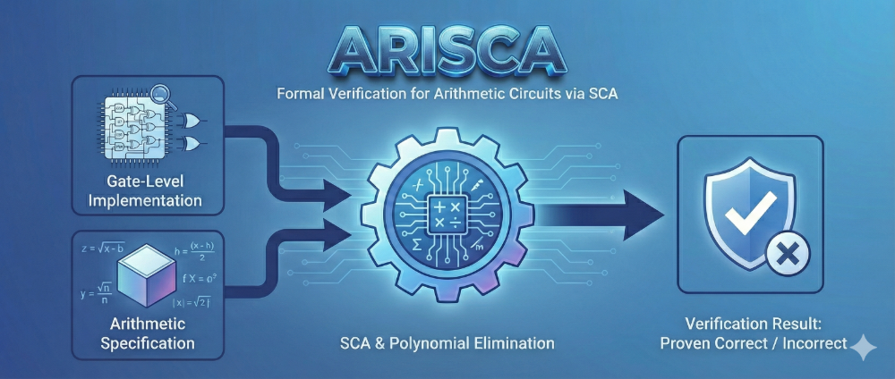

<div align="center">
<h1>Arisca</h1>
<p>
<strong>Formal Verification for Arithmetic Circuits via Symbolic Computer Algebra</strong>
</p>


</div>
Arisca is a formal verification tool designed to rigorously prove the correctness of arithmetic circuit units. It employs Symbolic Computer Algebra (SCA) and polynomial elimination techniques to mathematically verify that a gate-level circuit implementation matches its arithmetic specification.

## 📦 Build
Ensure you have the Rust toolchain installed.
```bash
# Clone the repository
git clone https://github.com/LittleBlackCQ/arisca.git
cd arisca

# Build the release binary
cargo build --release
```

## 🚀 Usage
Arisca processes AIGER (.aig) files.

```bash
cargo run --release --bin arisca <AIG_FILE> [OPTIONS]
```

### Default

When no `--spec` is given, Arisca assumes the circuit is a **multiplier**: it splits the input bits into two equal-width halves (e.g. a 128-input-bit circuit becomes 64×64), interprets both as unsigned integers, and checks that the full output (no truncation) equals their product.

```bash
cargo run --release --bin arisca examples/multiplier_simple.aig
```

### Specifying the arithmetic function with `--spec`

The `--spec` flag describes how input bits are grouped into variables and what arithmetic relationship the circuit should satisfy.

#### Spec syntax

| Syntax | Meaning |
|--------|---------|
| `[n]` | An unsigned variable of width n bits. Offsets auto-increment. |
| `[n:i]` | A variable of width n bits, starting at bit index i. |
| `o[n]` / `o[n:i]` | Same, but for **output** bits (used with `=`). |
| `+` | Addition |
| `*` | Multiplication |
| `(` `)` | Grouping |
| `=` | Equation: golden polynomial = **left − right** |

Input bits are consumed left-to-right as `[n]` variables appear in the spec. Offsets can be explicit (`[n:i]`) or implicit (auto-increment from 0).

#### Examples

**127×129-bit signed multiplier with truncated 250-bit output**
```bash
cargo run --release --bin arisca examples/multiplier.aig \
  --spec "[127]*[129]" --signed
```
`--signed` treats the MSB of each variable as a sign bit.

**256-bit adder with carry-in**
```bash
cargo run --release --bin arisca examples/adder.aig \
  --spec "[1]+[256]+[256]"
```

**63×65-bit multiply-accumulate with 128-bit addend**
```bash
cargo run --release --bin arisca examples/mac.aig \
  --spec "[63]*[65]+[128]"
```

**Dot product of two length-16 vectors of 8-bit elements**
```bash
cargo run --release --bin arisca examples/dotproduct.aig \
  --spec "[8:0]*[8:128]+[8:8]*[8:136]+[8:16]*[8:144]+[8:24]*[8:152]+[8:32]*[8:160]+[8:40]*[8:168]+[8:48]*[8:176]+[8:56]*[8:184]+[8:64]*[8:192]+[8:72]*[8:200]+[8:80]*[8:208]+[8:88]*[8:216]+[8:96]*[8:224]+[8:104]*[8:232]+[8:112]*[8:240]+[8:120]*[8:248]"
```
Explicit offsets are used to interleave elements from the two vectors.

**5-bit divider (equation style)**
```bash
cargo run --release --bin arisca examples/divider.aig \
  --spec "[5] = o[5]*[5] + o[5]"
```
When inputs and outputs are entangled (e.g. dividend = quotient × divisor + remainder), use `=` to write the full equation. Here:
- Left of `=`: `[5]` — the dividend (input variable)
- Right of `=`: `o[5]*[5] + o[5]` — quotient (output) × divisor (input) + remainder (output)

## 🧪 Running tests

```bash
# Run all tests (unit + integration)
cargo test --release

# Run only the integration tests
cargo test --release --test test_arithmetic

# Run a specific integration test
cargo test --release --test test_arithmetic test_divider
```

## 📄 License
See the LICENSE file for details.